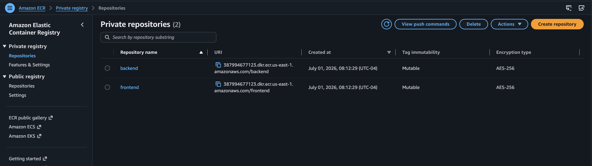
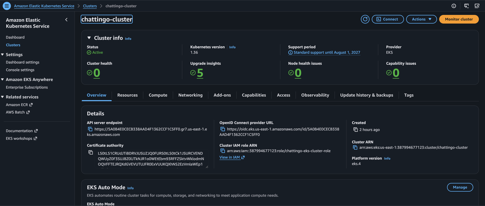
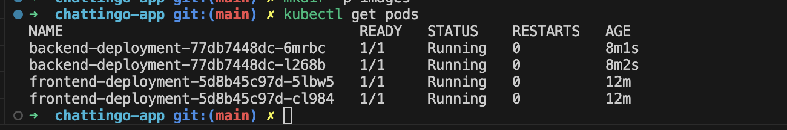

# 🚀 Chattingo - Mini Hackathon Challenge

A full-stack real-time chat application built with React, Spring Boot, and WebSocket technology. **Your mission**: Containerize this application using Docker and deploy it to Hostinger VPS using Jenkins CI/CD pipeline.

# 🚀 Chattingo — Production-Grade Cloud Deployment

A full-stack, real-time chat application built with React, Spring Boot, and WebSocket technology. This project has been transformed from a vanilla localized setup into a highly available, scalable, and secure containerized system running on **AWS Elastic Kubernetes Service (EKS)**, provisioned via **Terraform (Infrastructure as Code)**, and automated with a modern **CI/CD Pipeline**.


---

## 🏗️ Architecture Overview

The cloud infrastructure is built following AWS Best Practices for security, high availability, and separation of concerns:

* **Infrastructure as Code (IaC):** Complete AWS network topology and compute resources provisioned cleanly using **Terraform**.
* **Container Orchestration:** Managed **AWS EKS (Elastic Kubernetes Service)** cluster running multi-replica worker nodes across multiple Availability Zones.
* **Database Infrastructure:** A dedicated, isolated **AWS RDS (MySQL)** instance deployed within a private database subnet group, secured with custom security group rules allowing traffic only from the EKS nodes.
* **Traffic Ingress & Load Balancing:** Public-facing **AWS Load Balancers** manage external traffic ingress:
  * **Frontend Service Load Balancer:** Exposes the React UI on port `80`.
  * **Backend Service Load Balancer:** Exposes the Spring Boot API Gateway on port `8080`, allowing external cross-origin (CORS) browser requests.
* **Container Registry:** Dedicated private **AWS ECR (Elastic Container Registry)** repositories host the containerized build artifacts.

---

## 📸 Deployment Highlights

### 1. Secure Container Registry (AWS ECR)
Our Docker images are securely built, version-tagged, and stored within AWS ECR, allowing seamless access and deployment pull capabilities for our EKS cluster workloads.



### 2. Managed Kubernetes Cluster (AWS EKS)
The core compute runtime environment is driven by a production-ready AWS EKS cluster, implementing elastic scaling and native cloud monitoring.



### 3. High Availability Pod Distribution
Workloads are robustly distributed using multi-replica Kubernetes Deployments to guarantee continuous application availability and zero-downtime upgrades.



---

## 🛠️ Technology Stack

* **Frontend:** React.js, TailwindCSS, Axios
* **Backend:** Spring Boot, Java, Spring Security, WebSockets
* **Database:** AWS RDS MySQL
* **Infrastructure:** Terraform, AWS EKS, AWS ECR, AWS ELB, EC2
* **Orchestration:** Kubernetes (v1.30+)
* **CI/CD:** GitLab CI / GitHub Actions

---

## 🚀 Quick Start & Deployment Guide

### 1. Provisioning Infrastructure with Terraform
Navigate to the `terraform/` directory to review the environment layout and deploy the basic cloud components:

```bash
cd terraform
terraform init
terraform plan
terraform apply --auto-approve

## 🏗️ Architecture Overview

The cloud deployment is configured as a single-origin architecture running on AWS:

```
                  ┌─────────────────────────────────────────────────────────┐
                  │                       AWS VPC                           │
                  │                                                         │
                  │   ┌─────────────────────────────────────────────────┐   │
                  │   │                 AWS EKS Cluster                 │   │
                  │   │                                                 │   │
                  │   │   ┌──────────────────┐   Private   ┌─────────┐  │   │
                  │   │   │  Frontend Pods   │   Service   │ Backend │  │   │
                  │   │   │ (React + Nginx)  │◄───────────►│  Pods   │  │   │
                  │   │   │     Port: 80     │  Port: 8080 │(Spring) │  │   │
                  │   │   └────────▲─────────┘             └────┬────┘  │   │
                  │   └────────────┼────────────────────────────┼───────┘   │
                  │                │ (Proxy: /api, /auth, /ws)  │           │
                  │                │                            ▼           │
                  │                │                       ┌─────────┐      │
                  │                │                       │ AWS RDS │      │
                  │                │                       │ (MySQL) │      │
                  │                │                       │Port 3306│      │
                  │                │                       └─────────┘      │
                  └────────────────┼────────────────────────────────────────┘
                                   │
                                   ▼
                        ┌─────────────────────┐
                        │   AWS LoadBalancer  │
                        │   (ELB Ingress)     │
                        └─────────────────────┘
```

* **Client Traffic Ingress**: Users access the React application via the public **AWS ELB LoadBalancer** on port 80.
* **Same-Origin Reverse Proxying**: The React app makes API, Authentication (`/auth/*`), and WebSocket (`/ws/*`) requests to the same origin. The frontend **Nginx reverse proxy** routes those paths internally to the `backend-service` on port `8080` within the EKS cluster.
* **Isolated Database Networking**: The Spring Boot backend pods connect to **AWS RDS MySQL** on port 3306. The RDS instance resides in a private database subnet group and is secured with security groups that only permit access from the EKS nodes.

---

## 📊 Project Structure

```
chattingo-app/
├── backend/                 # Spring Boot application
│   ├── src/main/java/       # Java source code
│   │   └── com/chattingo/
│   │       ├── Controller/  # REST API controllers
│   │       ├── Service/     # Business logic Layer
│   │       ├── Model/       # JPA entities
│   │       └── config/      # Security, WebSocket, and App configs
│   ├── src/main/resources/  # Config files
│   ├── dockerfile           # Multi-stage Docker build for Backend
│   └── pom.xml              # Maven dependencies
├── frontend/                # React application
│   ├── src/                 # JS/JSX components & Redux actions
│   │   ├── Components/      # Chat UI pages and components
│   │   ├── Redux/           # Redux state & API actions
│   │   └── config/          # API endpoint URL configuration
│   ├── nginx.conf           # Reverse proxy configuration
│   ├── dockerfile           # Multi-stage Docker build for Frontend
│   └── package.json         # NPM dependencies
├── k8s/                     # Kubernetes resource manifests
│   ├── backend-deployment.yaml
│   ├── backend-service.yaml
│   ├── frontend-deployment.yaml
│   └── frontend-service.yaml
├── terraform/               # Infrastructure as Code
│   ├── main.tf              # VPC, subnets, EKS, RDS, ECR resources
│   ├── variables.tf         # Configuration variables
│   ├── outputs.tf           # Terraform output parameters
│   └── providers.tf         # AWS provider config
├── docker-compose.yml       # Local multi-container orchestration
├── CONTRIBUTING.md          # Setup & developer contribution guide
└── README.md                # This project documentation
```

